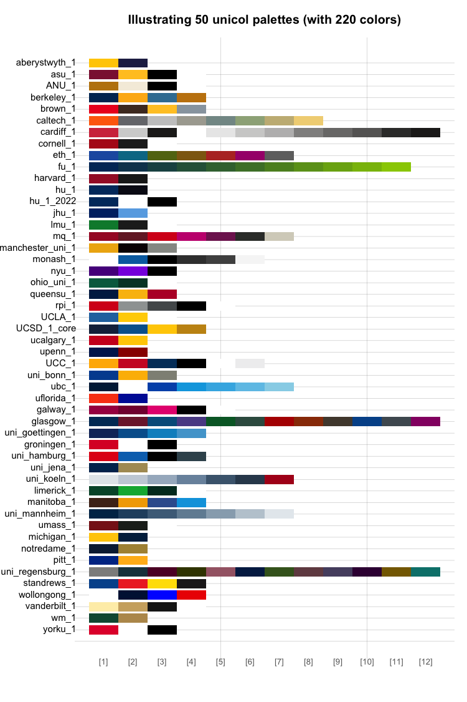

<!-- README.md is generated from README.Rmd. Please always edit the .Rmd file (and generate the .md file from it) -->

```{r setup, include = FALSE}
# Set default chunk options: 
knitr::opts_chunk$set(collapse = FALSE, 
                      comment = "#>", 
                      prompt = FALSE,
                      tidy = FALSE,
                      echo = TRUE, 
                      message = FALSE,
                      warning = FALSE,
                      # Default figure options:
                      fig.path = "man/figures/README-",
                      fig.align = 'center',  # ignored                 
                      dpi = 100,
                      fig.height = 5.0,
                      fig.width  = 7.0,
                      out.width = "600px")

library(unicol)  # load package

# URLs: ------ 

# unicol package: 
url_unicol_cran   <- "https://CRAN.R-project.org/package=unicol"
url_unicol_github <- "https://github.com/hneth/unicol"

url_github_doc_rel <- "https://hneth.github.io/unicol/"      # release version  
url_github_doc_dev <- "https://hneth.github.io/unicol/dev/"  # dev version

# unikn / Uni Konstanz:
url_unikn <- "https://www.uni-konstanz.de"

# unikn package: 
url_unikn_cran   <- "https://CRAN.R-project.org/package=unikn"
url_unikn_github <- "https://github.com/hneth/unikn"
```

<!-- Devel badges start: -->
[](https://CRAN.R-project.org/package=unicol)
[](https://www.r-pkg.org/pkg/unicol)
[](https://doi.org/10.5281/zenodo.8252106)
<!-- Devel badges end. -->


<!-- Release badges start: -->
<!-- [](https://CRAN.R-project.org/package=unicol) -->
<!-- [](https://www.r-pkg.org/pkg/unicol) -->
<!-- [](https://doi.org/10.5281/zenodo.8252106) -->
<!-- Release badges end. -->


<!-- ALL badges start: -->
<!-- [](https://CRAN.R-project.org/package=unicol) -->
<!-- [](https://github.com/hneth/unicol/actions/workflows/check-standard.yaml) -->
<!-- [](https://www.r-pkg.org/pkg/unicol) -->
<!-- [](https://www.r-pkg.org/pkg/unicol) -->
<!-- [](https://doi.org/10.5281/zenodo.8252106) -->
<!-- ALL badges end. -->


# unicol `r packageVersion('unicol')`  

<!-- unicol pkg logo and link: -->
<!-- <a href = "`r url_unicol_cran`"> -->
<!--  -->
<!-- </a> -->


<!-- Slogan: --> 

### The colors of your university {-}

<!-- DESCRIPTION / Mission / Vision: -->

Most universities use specific color combinations to express their unique brand identity. 
The **unicol** package provides the colors and color palettes of various universities for easy plotting and printing in\ R. 
We collect and provide a diverse range of color palettes for creating scientific visualizations. 

<!-- Goal / Objectives: -->

Our primary goal is to make it simple to create beautiful visualizations that are in accordance with institutional regulations and style guides. 
Assuming that you have some R\ code for creating an image, **unicol** allows you to directly use the color palette of your institution. 


## Installation

The latest release of **unicol** is available from [CRAN](https://CRAN.R-project.org) at <https://CRAN.R-project.org/package=unicol>:

```{r install-CRAN, echo = TRUE, eval = FALSE}
install.packages('unicol')  # install from CRAN client
library('unicol')           # load the package
```

The current development version can be installed from its [GitHub](https://github.com) repository at <https://github.com/hneth/unicol/>: 

```{r install-github, echo = TRUE, eval = FALSE}
# install.packages('devtools')  # install pkg
devtools::install_github('hneth/unicol')
```

<!-- Note: unicol is based on unikn -->

The **unicol** package is based on the R\ package **[unikn](`r url_unikn_cran`)** and requires it for key functionality. 


## Usage

The **unicol** package provides colors and color palettes, whereas the **[unikn](`r url_unikn_cran`)** package provides color-related functions:

```{r load-pkgs, message = FALSE}
library(unicol)  # for color palettes
library(unikn)   # for color functions
```


## Contents

```{r unicol-stats, echo = FALSE}
n_pals <- length(unique(unicol_data$pal))
n_inst <- length(unique(unicol_data$inst))
```

The **unicol** package currently provides **`r n_pals`\ color palettes** from **`r n_inst`\ institutions**. 

<!-- **Table\ 1** provides an overview of all color palettes:  -->

```{r unicol-pals-table-all, echo = FALSE, eval = FALSE}
# Data:
all_pals_df <- unicol_data
names(all_pals_df) <- c("Institution", "(aka.)", "URL", "Palette name")

tab_caption <- paste0("Overview of ", n_pals, " unicol palettes (from ", n_inst, " institutions).")

# Print table:
knitr::kable(all_pals_df, caption = tab_caption, row.names = TRUE)
```

(See the vignette **[All color palettes](https://hneth.github.io/unicol/articles/color_pals.html)** for an overview of included color palettes and institutions.) 

<!-- ## Examples  -->

<!-- Goal: Show some color palettes and how they can be used: -->


### Examples of color palettes

<!-- The **unicol** package currently contains **`r n_pals`\ color palettes** from **`r n_inst`\ institutions**.  -->

<!-- Example 1: Random pals (from vignette color_pals.Rmd): -->

```{r unicol-pals-example-1-parameters, echo = FALSE, eval = TRUE}
# Parameters:
N <- length(unicol_data$pal)
n <- 50 # N


# # Number of colors (from pal names):

# all_pals <- unicol_data$pal
# 
# # Number of pals and colors:
# n_pals <- length(all_pals)
# n_cols <- rep(NA, n_pals)
# 
# for (i in 1:n_pals){
#   n_cols[i] <- length(eval(str2expression(all_pals[i])))
# }
# 
# # n_cols
```

```{r unicol-pals-example-1-lists, echo = FALSE, eval = TRUE}
set.seed(147) # reproducible randomness

# A: Get sample_n of my_pals from all unicol_data$pal:
sample_n <- sort(sample(x = 1:N, size = n, replace = FALSE))
my_pals <- unicol_data$pal[sample_n]

# B: Get sample_n of primary_pals:
is_pal_1 <- grepl(pattern = "_1", unicol_data$pal)
# sum(is_pal_1)
primary_pals <- unicol_data$pal[is_pal_1]

N <- length(primary_pals)
sample_n <- sort(sample(x = 1:N, size = n, replace = FALSE))
my_pals <- primary_pals[sample_n]


# Initialize data structures:
pal_list  <- vector(mode = "list", length = n)
pal_names <- vector(mode = "character", length = n)
pal_len   <- rep(NA, n)
col_count <- 0

# Loop: Iterate through n palettes:
for (i in 1:n){
  
  # determine values:  
  cur_name  <- my_pals[i]
  cur_pal   <- get(cur_name)
  cur_count <- length(cur_pal)
  
  # collect values:
  pal_list[[i]] <- cur_pal
  pal_names[i]  <- cur_name
  pal_len[i]    <- cur_count
  col_count     <- col_count + cur_count
  
  # check criteria:
  if (cur_count > 12){
    
    message("Use different seed.")
    break
    
  }
  
} # for i loop end.

# # Add pal_names to pal_list:
# names(pal_list) <- pal_names
# 
# # Check:
# pal_names
# pal_list
# pal_len

# ToDo: Sort by pal_len. +++ here now +++ 


# Captions:
tab_caption <- paste0("A sample of ", n, " unicol palettes (containing ", col_count, " colors).")
fig_caption <- paste0("Figure 1: A sample of ", n, " unicol palettes (containing ", col_count, " colors).")
fig_main    <- paste0("Illustrating ", n, " unicol palettes (with ", col_count, " colors)")
```

```{r unicol-pals-example-1-stats, echo = FALSE, eval = FALSE}
# Stats (for n <- N):
n_pals  # number of color palettes: 235 on 2023-09-14. 
n_inst  # number of institutions:   102 on 2023-09-14.
# Colors (in current set):
col_count
length(unlist(pal_list))          # number of colors: 226 on 2023-09-14. 
length(unique(unlist(pal_list)))  # number of unique colors: 198 on 2023-09-14. 
```


<!-- Show as a table: -->

```{r unicol-pals-example-1-table, echo = FALSE, eval = FALSE}
knitr::kable(unicol_data[sample_n, ], caption = tab_caption)
```

<!-- Show as a figure: -->

**Figure\ 1** illustrates `r n` random color palettes (with `r col_count`\ colors): 

```{r unicol-pals-example-1-figure, echo = FALSE, eval = TRUE, dpi = 100, fig.width = 8, out.width = "680px", fig.asp = 1.6, fig.cap = fig_caption}
# Figure: Illustrate color palettes:
unikn::seecol(pal = pal_list,
              col_bg = "grey96",
              # n = 100, # continuous version
              scale_x = TRUE,  # scale to fixed width 
              pal_names = pal_names,
              main = fig_main)
```

<!--  -->


<!-- Example 2:  Insights into clusters / relations / similar sets -->

```{r example-insights, echo = FALSE, eval = FALSE}
bg_col <- "grey95"

# Red and grey:
seecol(list(bu, harvard_1, cornell_1, 
            yorku_1, groningen_1, 
            lancaster_1, mit, uchicago_1, 
            cmu_1, rpi_1, 
            mun_1, 
            cardiff_1, stanford_1),
       scale_x = FALSE, 
       main = "Red and grey university colors", col_bg = bg_col)


# Blues:
seecol(list(duke_1, jhu_1, columbia_1, 
            uni_goettingen_1, monash_1, hu_2, uni_mannheim_1, 
            # uni_koeln_1, uni_hamburg_1, # with 1 red 
            auckland_1, 
            uni_stuttgart_1, 
            # columbia_2, 
            ubc, 
            uni_konstanz_1,
            trinity_1),
       main = "Mostly blue and white university colors", col_bg = bg_col)


# Greens:
seecol(list(dartmouth_1, ohio_uni_1, limerick_1, stirling_1, lmu_1, fu_1), 
       main = "Mostly green university colors", col_bg = bg_col)


# Yellow and blue:
seecol(list(ucla_1, uci_1, pitt_1, carleton), 
       main = "Yellow and blue university colors", col_bg = bg_col)


# Purple and grey:
seecol(list(northwestern_1, western_uni), 
       main = "Purple and grey university colors", col_bg = bg_col)


# Task: Finding color twins / similar pairs:
seecol(list(groningen_1, yorku_1, cornell_1, harvard_1), main = "Spot the differences ", col_bg = bg_col)
seecol(list(notredame_1, uni_jena_1), main = "Color twins?", col_bg = bg_col)
```


### Using color palettes

As the **unicol** palettes are provided as vectors of R colors, they can simply be used as the `col` argument of R graphics functions. 
For instance, we can use the MIT colors (of the [Massachusetts Institute of Technology](https://web.mit.edu/)) in a bar plot 
(with the `barplot()` function of the base\ R **graphics** package) as follows:

```{r example-base-r-1}
barplot(height = 1:10,
        col = mit, 
        main = "Using the MIT colors")
```

To modify a color palette (e.g., by resizing the palette or adding transparency), we use the `usecol()` function of the 
**[unikn](https://CRAN.R-project.org/package=unikn)** package:

```{r example-base-r-2}
barplot(height = 1/sqrt(1:16), 
        col = usecol(mit, n = 16), 
        main = "A color gradient of MIT colors")
```

<!-- More examples: -->

Here are some some additional examples how the color palettes from **unicol** can be used:

```{r examples-unicol, message = FALSE}
# Viewing a color palette:
unikn::seecol(yale, main = "The primary colors of Yale University")
# Demo plots:
unikn::demopal(berkeley_1, type = 2, main = "The colors of Berkeley, University of California", seed = 3)
unikn::demopal(limerick_1, type = 3, main = "Using the colors of the University of Limerick", seed = 3)
```

<!-- ## Adding color palettes -->

<!-- Collecting contributed color palettes (in unicol): -->

## Your color palettes

The current range of color palettes included in **unicol** is highly selective and incomplete. 
However, we are happy to include color palettes and institutions from all over the world. 

If you are missing a color palette, you can easily create and add it. 
For instructions on how this can be done, please see the documentation of the `newpal()` function (of the **[unikn](`r url_unikn_cran`)** package). 
The vignette on [Institutional colors](https://hneth.github.io/unikn/articles/inst_colors.html) provides a corresponding example. 

**Call for contributions: Collecting color palettes**

- Are you using the **unikn** functions to create **your own color palettes**? 

If you do, **please let us know** (e.g., on this [GitHub issue](https://github.com/hneth/unicol/issues/30)) so that we can include it in future versions of the **unicol** package. 
To enable us to verify and provide credit to your contributions, please send us the following information:  

<!-- ToDo: -->
<a href = "https://github.com/hneth/unicol/issues/30">

</a>

1. your code (e.g., the `newpal()` command creating your color palette),   
2. your reference or source information (e.g., the names of the institution and some URL with color definitions),   
3. your name and some valid contact information (e.g., an Email address).  
  
We're looking forward to **your inputs and contributions** (at [this GitHub issue](https://github.com/hneth/unicol/issues/30))! 

<!-- +++ here now +++  -->


## Resources

The following versions of **unicol** and corresponding resources are available: 

Type:                         | Version:        | URL:                           | 
:-----------------------------|:----------------|:-------------------------------| 
A. **unicol** (R package): | [Release version](https://CRAN.R-project.org/package=unicol) | <https://CRAN.R-project.org/package=unicol> |
    &nbsp;                 | [Development version](https://github.com/hneth/unicol/)      | <https://github.com/hneth/unicol/> | 
B. Online documentation:   | [Release version](https://hneth.github.io/unicol/)           | <https://hneth.github.io/unicol/> | 
    &nbsp;                 | [Development version](https://hneth.github.io/unicol/dev/)   | <https://hneth.github.io/unicol/dev/> | 


## References 

<!-- Origin / Background / Credit / Course coordinates: --> 

<!-- Origin:  -->

<!-- Uni Konstanz / uni.kn logo and link: -->
<a href = "`r url_unikn`">

</a>

The **unicol** package originated as a collaborative project of the following course:

* **Open Source Software Development in R** (ADILT applications, PSY-18040), at the **[University of Konstanz](https://www.uni-konstanz.de/en/)**   
* Spring/Summer\ 2023: **Tuesdays**, **13:30—15:00**; in **C426** 
* By **[Hansjörg Neth](https://neth.de/)** (<h.neth@uni.kn>, [SPDS](https://www.spds.uni-konstanz.de/), [University of Konstanz](https://www.uni-konstanz.de/en/))


### License

<!-- License: CC BY-SA 4.0 (also in Description) -->

<!-- Image with link: --> 

<a rel="license" href="https://creativecommons.org/licenses/by-sa/4.0/"></a>

<!-- Text with links: --> 

<span xmlns:dct="https://purl.org/dc/terms/" property="dct:title"><strong>unicol</strong></span> (created by <a xmlns:cc="https://creativecommons.org/ns#" href="https://github.com/hneth/unikn" property="cc:attributionName" rel="cc:attributionURL">Hansjörg Neth et al.</a>) is licensed under a <a rel="license" href="https://creativecommons.org/licenses/by-sa/4.0/">Creative Commons Attribution-ShareAlike 4.0 International License</a>. (Based on a work at <a xmlns:dct="https://purl.org/dc/terms/" href="https://github.com/hneth/unicol" rel="dct:source">https://github.com/hneth/unicol</a>).


<!-- Relation to unikn:: -->

<!-- unikn pkg logo and link: -->
<!-- <a href = "`r url_unikn_cran`"> -->
<!--  -->
<!-- </a> -->

The **unicol** package is based on the R\ package **[unikn](`r url_unikn_cran`)** and loads key functionality from it. 


### Citation 

<!-- unicol pkg logo and link: -->
<a href = "`r url_unicol_cran`">

</a> 

To support our efforts, please cite the **unicol** package in your derivations or publications: 

<!-- Citation / reference (in APA format): -->

- Neth, H. et al. (2024). 
unicol: The colors of your university.  
Social Psychology and Decision Sciences, University of Konstanz, Germany.  
Computer software (R package version 0.3.0, May 1, 2024).  
Retrieved from <https://CRAN.R-project.org/package=unicol>.  
doi\ [10.5281/zenodo.8252106](https://doi.org/10.5281/zenodo.8252106) 


<!-- BibTeX:  -->

A BibTeX entry for LaTeX users is:

```{r pkg-unicol-citation, echo = FALSE, eval = TRUE, comment = "", highlight = FALSE}
# From package citation:
x <- citation(package = 'unicol')
# print(x, prefix = "")
toBibtex(x)
```

<!-- Copyrights of designs: -->

The copyrights to all **unicol** designs remain with their original creators. 

<!-- ## Contact -->

<!-- ToDo: Add contact details here. -->


------


<!-- Footer: -->

[File `README.Rmd` updated on `r Sys.Date()`.]

<!-- eof. --> 
