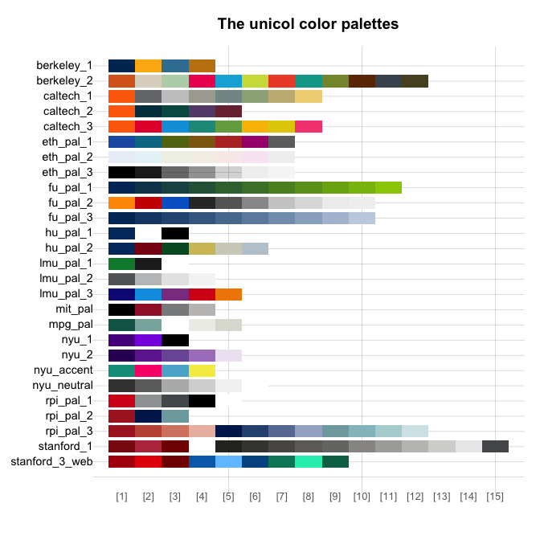
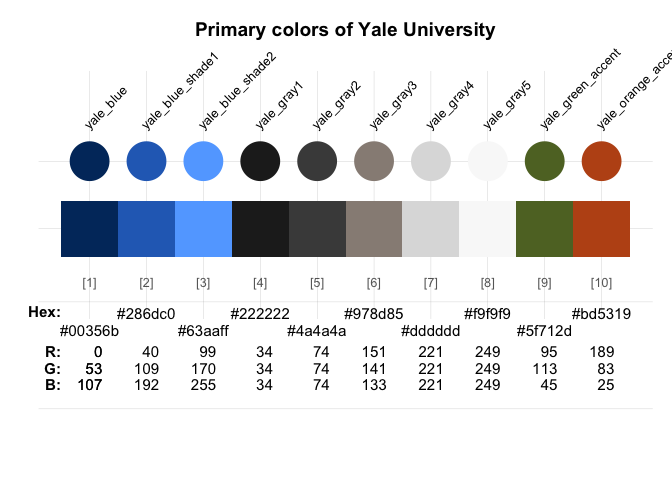
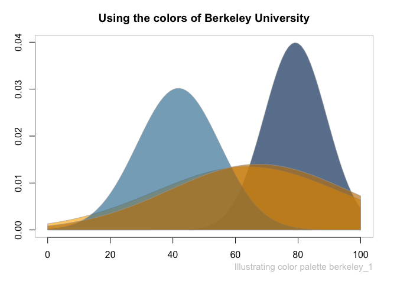
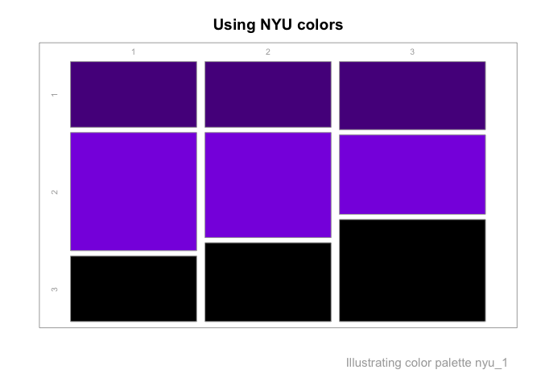

<!-- README.md is generated from README.Rmd. Please always edit the .Rmd file (and generate the .md file from it) -->

# unicol

<!-- badges: start -->
<!-- badges: end -->

The colors of your university.

## Goal

The R package **unicol** provides colors and color palettes for various
universities.

<!-- Course coordinates: -->

The **unicol** package was developed as a collaborative project by the
following course:

- **Open Source Software Development in R** (ADILT applications,
  PSY-18040), at **[University of
  Konstanz](https://www.uni-konstanz.de/en/)**  
- Spring 2023: **Tuesdays**, **13:30-15:00**; in **C426**
- Taught by **[Hansjörg Neth](https://neth.de/)** (<h.neth@uni.kn>,
  [SPDS](https://www.spds.uni-konstanz.de/), [University of
  Konstanz](https://www.uni-konstanz.de/en/))

<!-- Goal: -->

The goal of **unicol** is to provide university color palettes for
creating scientific visualizations.

This package is based on the R package
**[unikn](https://CRAN.R-project.org/package=unikn)** and loads key
functionality from it.

## Installation

You can install the development version of **unicol** from
[GitHub](https://github.com/) with:

``` r
# install.packages("devtools")
devtools::install_github("hneth/unicol")
```

## Usage

The **unicol** package provides colors and color palettes, whereas the
**[unikn](https://CRAN.R-project.org/package=unikn)** provides
color-related functions:

``` r
library(unicol)  # for color palettes
library(unikn)   # for color functions
```

## Contents

<!-- A list of all unicol palettes: -->

The **unicol** package currently contains 25 color palettes (with a
total of 165 colors) from Z institutions.

An overview of the current color palettes provided by the **unicol**
package:



## Examples

Here are some examples how the color palettes from **unicol** can be
used:

``` r
seecol(uni_yale_primary, main = "Primary colors of Yale University")
```



``` r
demopal(uni_berkeley_primary_1, type = 2, main = "Using the colors of Uni Berkeley")
```



``` r
demopal(nyu_1, type = 3, main = "NYU colors")
```



------------------------------------------------------------------------

<!-- Footer: -->

\[File `README.Rmd` updated on 2023-06-16.\]

<!-- eof. -->
