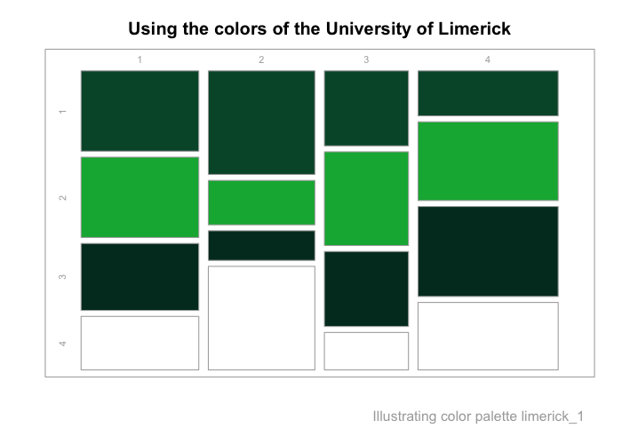

<!-- README.md is generated from README.Rmd. Please always edit the .Rmd file (and generate the .md file from it) -->
<!-- Devel badges start: -->

[](https://CRAN.R-project.org/package=unicol)
[](https://www.r-pkg.org/pkg/unicol)
[](https://doi.org/10.5281/zenodo.8252106)
<!-- Devel badges end. -->

<!-- Release badges start: -->
<!-- [](https://CRAN.R-project.org/package=unicol) -->
<!-- [](https://www.r-pkg.org/pkg/unicol) -->
<!-- [](https://doi.org/10.5281/zenodo.8252106) -->
<!-- Release badges end. -->
<!-- ALL badges start: -->
<!-- [](https://CRAN.R-project.org/package=unicol) -->
<!-- [](https://github.com/hneth/unicol/actions/workflows/check-standard.yaml) -->
<!-- [](https://www.r-pkg.org/pkg/unicol) -->
<!-- [](https://www.r-pkg.org/pkg/unicol) -->
<!-- [](https://doi.org/10.5281/zenodo.8252106) -->
<!-- ALL badges end. -->

# unicol 0.2.0.9002 

<!-- unicol pkg logo and link: -->
<!-- <a href = "https://CRAN.R-project.org/package=unicol"> -->
<!--  -->
<!-- </a> -->
<!-- Slogan: -->

### The colors of your university

<!-- DESCRIPTION / Mission / Vision: -->

Most universities use specific color combinations to express their
unique brand identity. The **unicol** package provides the colors and
color palettes of various universities for easy plotting and printing
in R. We collect and provide a diverse range of color palettes for
creating scientific visualizations.

<!-- Goal / Objectives: -->

Our primary goal is to make it simple to create beautiful visualizations
that are in accordance with institutional regulations and style guides.
Assuming that you have some R code for creating an image, **unicol**
allows you to directly use the color palette of your institution.

## Installation

The latest release of **unicol** is available from
[CRAN](https://CRAN.R-project.org) at
<https://CRAN.R-project.org/package=unicol>:

``` r
install.packages('unicol')  # install from CRAN client
library('unicol')           # load the package
```

The current development version can be installed from its
[GitHub](https://github.com) repository at
<https://github.com/hneth/unicol/>:

``` r
# install.packages('devtools')  # install pkg
devtools::install_github('hneth/unicol')
```

<!-- Note: unicol is based on unikn -->

The **unicol** package is based on the R package
**[unikn](https://CRAN.R-project.org/package=unikn)** and requires it
for key functionality.

## Usage

The **unicol** package provides colors and color palettes, whereas the
**[unikn](https://CRAN.R-project.org/package=unikn)** package provides
color-related functions:

``` r
library(unicol)  # for color palettes
library(unikn)   # for color functions
```

## Contents

The **unicol** package currently provides **239 color palettes** from
**103 institutions**.

<!-- **Table\ 1** provides an overview of all color palettes:  -->

(See the vignette on **[Color
palettes](https://hneth.github.io/unicol/articles/color_pals.html)** for
an overview of included color palettes and institutions.)

<!-- ## Examples  -->
<!-- Goal: Show some color palettes and how they can be used: -->

### Examples of color palettes

<!-- The **unicol** package currently contains **239\ color palettes** from **103\ institutions**.  -->
<!-- Example 1: Random pals (from vignette color_pals.Rmd): -->
<!-- Show as a table: -->
<!-- Show as a figure: -->

**Figure 1** illustrates 50 random color palettes (with 216 colors):

<div class="figure" style="text-align: center">


<p class="caption">
Figure 1: A sample of 50 unicol palettes (containing 216 colors).
</p>

</div>

<!--  -->
<!-- Example 2:  Clusters / relations / similar sets -->

### Using color palettes

As the **unicol** palettes are provided as vectors of R colors, they can
simply be used as the `col` argument of R graphics functions. For
instance, we can use the MIT colors (of the [Massachusetts Institute of
Technology](https://web.mit.edu/)) in a bar plot (with the `barplot()`
function of the base R **graphics** package) as follows:

``` r
barplot(height = 1:10,
        col = mit, 
        main = "Using the MIT colors")
```


To modify a color palette (e.g., by resizing the palette or adding
transparency), we use the `usecol()` function of the
**[unikn](https://CRAN.R-project.org/package=unikn)** package:

``` r
barplot(height = 1/sqrt(1:16), 
        col = usecol(mit, n = 16), 
        main = "A color gradient of MIT colors")
```


<!-- More examples: -->

Here are some some additional examples how the color palettes from
**unicol** can be used:

``` r
# Viewing a color palette:
unikn::seecol(yale, main = "The primary colors of Yale University")
```


``` r
# Demo plots:
unikn::demopal(berkeley_1, type = 2, main = "The colors of Berkeley, University of California", seed = 3)
```


``` r
unikn::demopal(limerick_1, type = 3, main = "Using the colors of the University of Limerick", seed = 3)
```



<!-- ## Adding color palettes -->
<!-- Collecting contributed color palettes (in unicol): -->

## Your color palettes

The current range of color palettes included in **unicol** is highly
selective and incomplete. However, we are happy to include color
palettes and institutions from all over the world.

If you are missing a color palette, you can easily create and add it.
For instructions on how this can be done, please see the documentation
of the `newpal()` function (of the
**[unikn](https://CRAN.R-project.org/package=unikn)** package). The
vignette on [Institutional
colors](https://hneth.github.io/unikn/articles/color_inst.html) provides
a corresponding example.

**Call for contributions: Collecting color palettes**

- Are you using the **unikn** functions to create **your own color
  palettes**?

If you do, **please let us know** (e.g., on this [GitHub
issue](https://github.com/hneth/unicol/issues/30)) so that we can
include it in future versions of the **unicol** package. To enable us to
verify and provide credit to your contributions, please send us the
following information:

<!-- ToDo: -->

<a href = "https://github.com/hneth/unicol/issues/30">

</a>

1.  your code (e.g., the `newpal()` command creating your color
    palette),  
2.  your reference or source information (e.g., the names of the
    institution and some URL with color definitions),  
3.  your name and some valid contact information (e.g., an Email
    address).

We’re looking forward to **your inputs and contributions** (at [this
GitHub issue](https://github.com/hneth/unicol/issues/30))!

<!-- +++ here now +++  -->

## Resources

The following versions of **unicol** and corresponding resources are
available:

| Type:                      | Version:                                                     | URL:                                        |
|:---------------------------|:-------------------------------------------------------------|:--------------------------------------------|
| A. **unicol** (R package): | [Release version](https://CRAN.R-project.org/package=unicol) | <https://CRAN.R-project.org/package=unicol> |
|                            | [Development version](https://github.com/hneth/unicol/)      | <https://github.com/hneth/unicol/>          |
| B. Online documentation:   | [Release version](https://hneth.github.io/unicol/)           | <https://hneth.github.io/unicol/>           |
|                            | [Development version](https://hneth.github.io/unicol/dev/)   | <https://hneth.github.io/unicol/dev/>       |

## References

<!-- Origin / Background / Credit / Course coordinates: -->
<!-- Origin:  -->
<!-- Uni Konstanz / uni.kn logo and link: -->

<a href = "https://www.uni-konstanz.de">

</a>

The **unicol** package originated as a collaborative project of the
following course:

- **Open Source Software Development in R** (ADILT applications,
  PSY-18040), at the **[University of
  Konstanz](https://www.uni-konstanz.de/en/)**  
- Spring/Summer 2023: **Tuesdays**, **13:30—15:00**; in **C426**
- By **[Hansjörg Neth](https://neth.de/)** (<h.neth@uni.kn>,
  [SPDS](https://www.spds.uni-konstanz.de/), [University of
  Konstanz](https://www.uni-konstanz.de/en/))

### License

<!-- License: CC BY-SA 4.0 (also in Description) -->
<!-- Image with link: -->

<a rel="license" href="https://creativecommons.org/licenses/by-sa/4.0/"></a>

<!-- Text with links: -->

<span xmlns:dct="https://purl.org/dc/terms/"
property="dct:title"><strong>unicol</strong></span> (created by
<a xmlns:cc="https://creativecommons.org/ns#" href="https://github.com/hneth/unikn" property="cc:attributionName" rel="cc:attributionURL">Hansjörg
Neth et al.</a>) is licensed under a
<a rel="license" href="https://creativecommons.org/licenses/by-sa/4.0/">Creative
Commons Attribution-ShareAlike 4.0 International License</a>. (Based on
a work at
<a xmlns:dct="https://purl.org/dc/terms/" href="https://github.com/hneth/unicol" rel="dct:source">https://github.com/hneth/unicol</a>).

<!-- Relation to unikn:: -->
<!-- unikn pkg logo and link: -->
<!-- <a href = "https://CRAN.R-project.org/package=unikn"> -->
<!--  -->
<!-- </a> -->

The **unicol** package is based on the R package
**[unikn](https://CRAN.R-project.org/package=unikn)** and loads key
functionality from it.

### Citation

<!-- unicol pkg logo and link: -->

<a href = "https://CRAN.R-project.org/package=unicol">

</a>

To support our efforts, please cite the **unicol** package in your
derivations or publications:

<!-- Citation / reference (in APA format): -->

- Neth, H. et al. (2023). unicol: The colors of your university.  
  Social Psychology and Decision Sciences, University of Konstanz,
  Germany.  
  Computer software (R package version 0.2.0, September 15, 2023).  
  Retrieved from <https://CRAN.R-project.org/package=unicol>.  
  doi [10.5281/zenodo.8252106](https://doi.org/10.5281/zenodo.8252106)

<!-- BibTeX:  -->

A BibTeX entry for LaTeX users is:

    @Manual{,
      title = {unicol: The colors of your university},
      author = {Hansjoerg Neth and Constantin Basler and Paula Bauer and Kaethe Bodenstein and Franziska Drechsel and Gina-Loretta Franz and Karolin Heiss and Julia Koenig and Isabelle Krist and Larissa Schwab and Alina Sohst and Isabel Staatz and Lisa Trueb},
      year = {2023},
      organization = {Social Psychology and Decision Sciences, University of Konstanz},
      address = {Konstanz, Germany},
      note = {R package (version 0.2.0, September 15, 2023)},
      url = {https://CRAN.R-project.org/package=unicol},
      doi = {10.5281/zenodo.8252106},
    }

<!-- Copyrights of designs: -->

The copyrights to all **unicol** designs remain with their original
creators.

<!-- ## Contact -->
<!-- ToDo: Add contact details here. -->

------------------------------------------------------------------------

<!-- Footer: -->

\[File `README.Rmd` updated on 2023-09-20.\]

<!-- eof. -->
