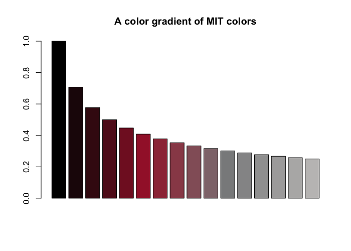

<!-- README.md is generated from README.Rmd. Please always edit the .Rmd file (and generate the .md file from it) -->
<!-- badges: start -->
<!-- badges: end -->

# unicol 0.1.0 

<!-- unicol pkg logo and link: -->
<!-- <a href = "https://github.com/hneth/unicol"> -->
<!--  -->
<!-- </a> -->
<!-- Slogan: -->

### The colors of your university

<!-- DESCRIPTION / Mission / Vision: -->

The **unicol** package provides the colors and color palettes of various
universities for easy plotting and printing in R. We collect and provide
a diverse range of color palettes for creating scientific
visualizations.

<!-- Goal / Objectives: -->

Our primary goal is to make it simple to create beautiful visualizations
that are in accordance with institutional style guides. Assuming that
you have some R code for creating an image, the **unicol** allows you to
directly use the color palette of your institution.

## Installation

You can install the development version of **unicol** from
[GitHub](https://github.com/) with:

``` r
# install.packages("devtools")
devtools::install_github("hneth/unicol")
```

## Usage

The **unicol** package provides colors and color palettes, whereas the
**[unikn](https://CRAN.R-project.org/package=unikn)** package provides
color-related functions:

``` r
library(unicol)  # for color palettes
library(unikn)   # for color functions
```

## Contents

The **unicol** package currently provides **202 color palettes** from
**86 institutions**.

<!-- **Table\ 1** provides an overview of all color palettes:  -->

(See the vignette on **Color palettes** for an overview of all color
palettes and institutions.)

<!-- ## Examples  -->
<!-- Goal: Show some color palettes and how they can be used: -->

### Examples of color palettes

<!-- The **unicol** package currently contains **202\ color palettes** from **86\ institutions**.  -->
<!-- Example 1: Random pals (from vignette color_pals.Rmd): -->
<!-- Show as a table: -->
<!-- Show as a figure: -->

**Figure 1** illustrates 50 random color palettes (with 265 colors):

<div class="figure" style="text-align: center">


<p class="caption">
Figure 1: A sample of 50 unicol palettes (containing 265 colors).
</p>

</div>

### Using color palettes

As the **unicol** palettes are provided as vectors of R colors, they can
simply be used as the `col` argument of R graphics functions. For
instance, we can use the MIT colors (of the [Massachusetts Institute of
Technology](https://web.mit.edu/)) in a bar plot (with the `barplot()`
function of the base R **graphics** package) as follows:

``` r
barplot(height = 1:10,
        col = mit_pal, 
        main = "Using the MIT colors")
```


To modify a color palette (e.g., by resizing the palette or adding
transparency), we use the `usecol()` function of the
**[unikn](https://CRAN.R-project.org/package=unikn)** package:

``` r
barplot(height = 1/sqrt(1:16), 
        col = usecol(mit_pal, n = 16), 
        main = "A color gradient of MIT colors")
```



<!-- More examples: -->

Here are some some additional examples how the color palettes from
**unicol** can be used:

``` r
# Viewing a color palette:
unikn::seecol(yale_1, main = "The primary colors of Yale University")
```


``` r
# Demo plots:
unikn::demopal(berkeley_1, type = 2, main = "The colors of Berkeley, University of California", seed = 3)
```


``` r
unikn::demopal(limerick_1, type = 3, main = "Using the colors of the University of Limerick", seed = 3)
```


<!-- ## Adding color palettes -->
<!-- Collecting contributed color palettes (in unicol): -->

## Your color palettes

<!-- unicol pkg logo and link: -->

<a href = "https://github.com/hneth/unicol">

</a>

The current range of color palettes included in **unicol** is selective
and incomplete. We are always happy to include new color palettes and
institutions from all over the world.

If you are missing a color palette, you can easily create it. For
instructions how this can be done, please see the documentation of the
`newpal()` function (of the
**[unikn](https://CRAN.R-project.org/package=unikn)** package). The
vignette on [Institutional
colors](https://hneth.github.io/unikn/articles/color_inst.html) provides
a corresponding example.

**Call for contributions: Collecting color palettes**

- Are you using the **unikn** color functions to create **your own color
  palettes**?

<!-- ToDo: -->

<a href = "https://github.com/hneth/unicol/issues/30">

</a>

If you do create a new color palette, **please let us know** (on this
[GitHub issue](https://github.com/hneth/unicol/issues/30)) so that we
can include it in future versions of the **unicol** package. To enable
us to verify and provide credit to your contributions, please send us
the following information:

1.  your code (e.g., the `newpal()` command creating your color
    palette),  
2.  your reference or source information (e.g., some URL with color
    definitions),  
3.  your name and some contact information (e.g., an Email address).

We’re looking forward to **your inputs and contributions** (at this
[GitHub issue](https://github.com/hneth/unicol/issues/30))!

## References

<!-- Origin / Background / Credit / Course coordinates: -->

### Origin

<!-- unikn logo and link: -->

<a href = "https://www.uni-konstanz.de/">

</a>

The **unicol** package originated as a collaborative project by the
following course:

- **Open Source Software Development in R** (ADILT applications,
  PSY-18040), at **[University of
  Konstanz](https://www.uni-konstanz.de/en/)**  
- Spring/Summer 2023: **Tuesdays**, **13:30-15:00**; in **C426**
- Taught by **[Hansjörg Neth](https://neth.de/)** (<h.neth@uni.kn>,
  [SPDS](https://www.spds.uni-konstanz.de/), [University of
  Konstanz](https://www.uni-konstanz.de/en/))

<!-- Relation to unikn:: -->
<!-- unikn pkg logo and link: -->
<!-- <a href = "https://CRAN.R-project.org/package=unikn"> -->
<!--  -->
<!-- </a> -->

This package is based on the R package
**[unikn](https://CRAN.R-project.org/package=unikn)** and loads key
functionality from it.

<!-- +++ here now +++  -->

### Citation

To support our efforts, please cite the **unicol** package in your
derivations or publications.

<!-- Citation / reference (in APA format): -->
<!-- BibTeX:  -->

A BibTeX entry for LaTeX users is:

    @Manual{,
      title = {unicol: The colors of your university},
      author = {Hansjoerg Neth and Constantin Basler and Paula Bauer and Kaethe Bodenstein and Franziska Drechsel and Gina-Loretta Franz and Karolin Heiss and Julia Koenig and Isabelle Krist and Larissa Schwab and Alina Sohst and Isabel Staatz and Lisa Trueb},
      year = {2023},
      organization = {Social Psychology and Decision Sciences, University of Konstanz},
      address = {Konstanz, Germany},
      note = {R package (version 0.1.0, August 15, 2023)},
      url = {https://github.com/hneth/unicol/},
    }

<!-- Copyrights of designs: -->

The copyrights to all **unicol** designs remain with their original
creators.

<!-- ## Contact -->
<!-- ToDo: Add contact details here. -->

------------------------------------------------------------------------

<!-- Footer: -->

\[File `README.Rmd` updated on 2023-08-14.\]

<!-- eof. -->
