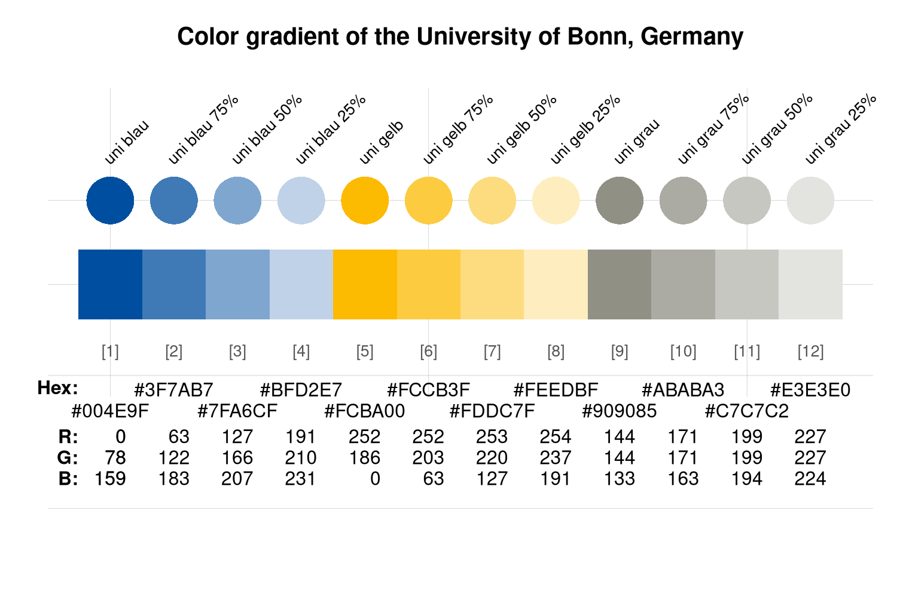
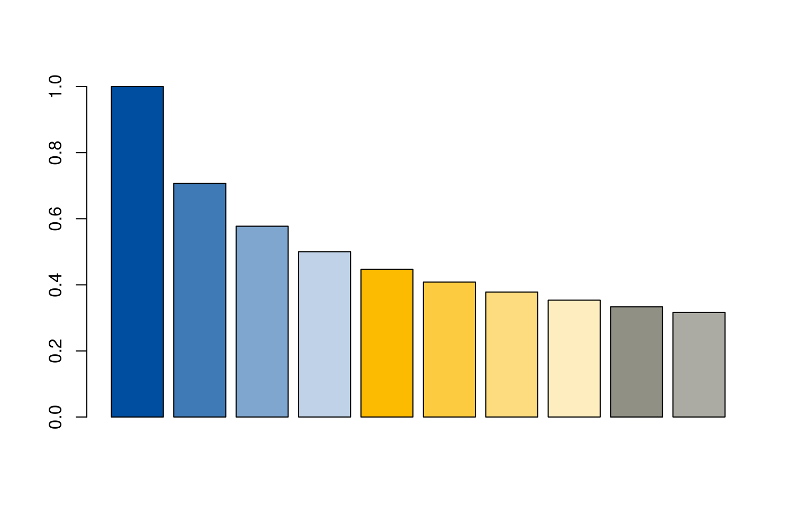
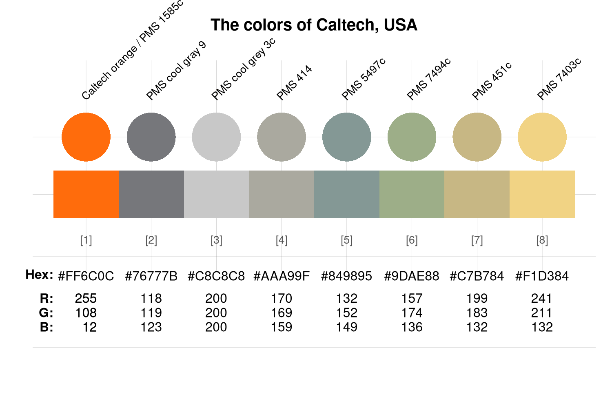
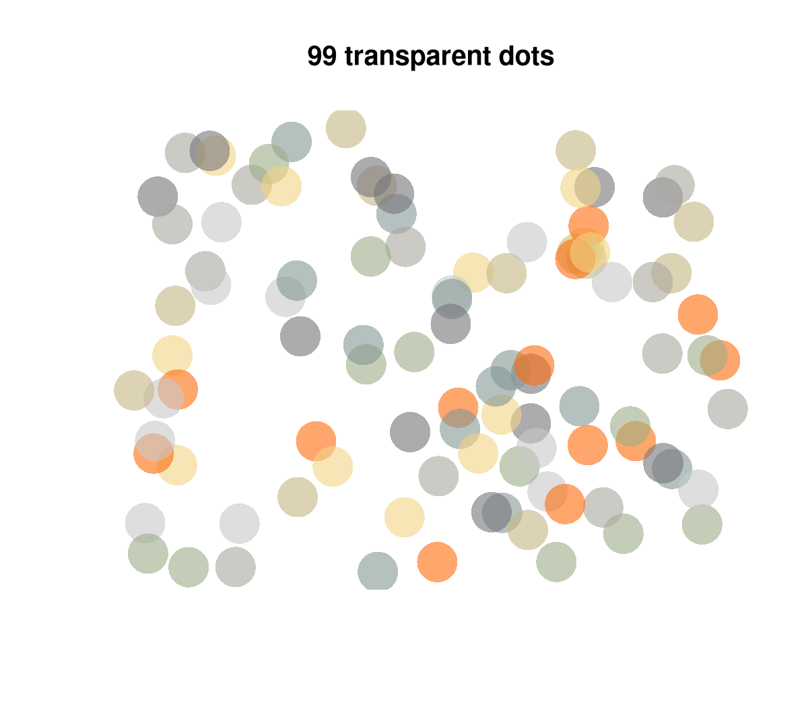

# Using color palettes

[](https://CRAN.R-project.org/package=unicol)

This vignettes shows **how to** use the color palettes included in the
**unicol** R package. (See the [All color
palettes](https://hneth.github.io/unicol/dev/articles/color_pals.md)
vignette for an overview of the palettes included in the package.)

We install or load the **unicol** package to get started:

``` r
# install.packages('unicol')  # install unicol from CRAN client
library('unicol')             # load the package
```

Loading the **unicol** package automatically makes the color functions
of the required **[unikn](https://CRAN.R-project.org/package=unikn)**
package available.

## Using colors in **base** R

**Task:** Using **unicol** colors in visualizations created by **base**
R graphics.

The **unicol** color palettes are typically provided as named vectors of
color objects. Thus, when creating **base** R visualizations (e.g.,
using [`plot()`](https://rdrr.io/r/graphics/plot.default.html) for
creating a scatterplot), we can directly use a color palette as the
`col` argument.

For instance, let’s assume we wanted to create a bar chart using the
color palette `uni_bonn_2` (of the [University of
Bonn](https://www.uni-bonn.de), Germany):

``` r
# View color palette:
unikn::seecol(uni_bonn_2, main = "Color gradient of the University of Bonn, Germany")
```



We can simply provide the color palette to the `col` argument of the
[`barplot()`](https://rdrr.io/r/graphics/barplot.html) function:

``` r
# Use a color palette:
barplot(1/sqrt(1:10), col = uni_bonn_2)
```



In case we want to modify a color palette (e.g., change its number of
colors or add transparency) before using it, we can do so by using the
[`usecol()`](https://rdrr.io/pkg/unikn/man/usecol.html) function of the
**[unikn](https://CRAN.R-project.org/package=unikn)** package before
providing the modified palette as the `col` argument of an R graphics
function. The following examples illustrate both of these alternatives.

``` r
# View color palette:
unikn::seecol(caltech_1, main = "The colors of Caltech, USA")
```



1.  Directly using a color palette (e.g., the color
    palette `caltech_1`):

``` r
plot(x = runif(99), y = runif(99), type = "p", 
     pch = 16, cex = 4,
     col = caltech_1,
     main = "99 dots (in Caltech colors)", axes = FALSE, xlab = NA, ylab = NA)
```


2.  Using a transformed color palette (after using the
    [`usecol()`](https://rdrr.io/pkg/unikn/man/usecol.html) function of
    the **[unikn](https://CRAN.R-project.org/package=unikn)** package
    for resizing and adding transparency to the palette):

``` r
my_col <- unikn::usecol(caltech_1, alpha = .60)  # with transparency

plot(x = runif(99), y = runif(99), type = "p", 
     pch = 16, cex = 4,
     col = my_col,
     main = "99 transparent dots", axes = FALSE, xlab = NA, ylab = NA)
```



## Using colors in **ggplot2**

**Task:** Using **unicol** colors in visualizations created by the
**ggplot2** package.

When using the
[`ggplot()`](https://ggplot2.tidyverse.org/reference/ggplot.html)
function of **ggplot2** (e.g., for creating an area plot), we wrap the
color palette in the
[`usecol()`](https://rdrr.io/pkg/unikn/man/usecol.html) function (of the
**unikn** package) for defining a color palette (of the desired length
and transparency). The resulting color palette can then be provided as
the `values` of **ggplot2**’s
[`scale_color_manual()`](https://ggplot2.tidyverse.org/reference/scale_manual.html)
or
[`scale_fill_manual()`](https://ggplot2.tidyverse.org/reference/scale_manual.html)
functions:

1.  Wrap the desired color palette in the
    [`usecol()`](https://rdrr.io/pkg/unikn/man/usecol.html) function of
    **unikn**.

2.  Provide this palette as the `values` of the **ggplot2** functions
    [`scale_color_manual()`](https://ggplot2.tidyverse.org/reference/scale_manual.html)
    or
    [`scale_fill_manual()`](https://ggplot2.tidyverse.org/reference/scale_manual.html).

``` r
# 0. Create some data to plot: ---- 

# Example based on https://r-graph-gallery.com/137-spring-shapes-data-art/
n <- 50
groups <- 1:n
df <- data.frame()

set.seed(3)

for (i in seq(1:30)){
  data = data.frame(matrix(0, n, 3))
  data[, 1] <- i
  data[, 2] <- sample(groups, nrow(data))
  data[, 3] <- prop.table(sample(c(rep(0, 100), c(1:n)), nrow(data)))
  df = rbind(df, data)}

names(df) <- c("X","Group","Y")
df$Group <- as.factor(df$Group)  
df <- df[c(2, 1, 3)]
df <- df[order(df$X, df$Group) , ]
rownames(df) <- NULL

my_data <- df

# # View data (as wider table):
# my_data_wider <- tidyr::pivot_wider(my_data, names_from = Group, names_prefix = "g_", values_from = Y)
# knitr::kable(my_data_wider, caption = "Viewing data (in wider format).")


# 1. Colors: ---- 

# A. Using RColorBrewer: 
# library(RColorBrewer)

# my_pal <- brewer.pal(11, "Paired")
# my_pal <- colorRampPalette(my_pal)(n)
# my_pal <- my_pal[sample(c(1:length(my_pal)), size = length(my_pal))]  # randomize

# B. Using unicol colors:
library(unicol)

# Mix a color gradient: 
my_pal <- unikn::usecol(princeton_1, n = 50)
# my_pal <- my_pal[sample(c(1:length(my_pal)), size = length(my_pal))]  # randomize


# 2. Plotting (with ggplot2): ---- 

library(ggplot2)

ggplot2::ggplot(my_data, aes(x = X, y = Y, fill = Group)) + 
  geom_area() +
  scale_fill_manual(values = my_pal) +
  theme_void() +
  theme(legend.position = "none")
```


## Resources

See the [Color
recipes](https://hneth.github.io/unikn/articles/color_recipes.html)
vignette (of the **[unikn](https://CRAN.R-project.org/package=unikn)**
package) for solving color-related tasks like:

- Viewing and comparing color palettes
- Finding similar colors
- Finding colors by name
- Getting shades of a color
- Creating color gradients
- Creating new color palettes

## Vignettes

[](https://CRAN.R-project.org/package=unicol)

The following vignettes provide an overview of and examples for using
the **unicol** color palettes:

| Nr. | Vignette                                                                          | Content                                         |
|----:|:----------------------------------------------------------------------------------|:------------------------------------------------|
| 1\. | [All color palettes](https://hneth.github.io/unicol/dev/articles/color_pals.md)   | The color palettes of the **unicol** R package  |
| 2\. | [Using color palettes](https://hneth.github.io/unicol/dev/articles/using_pals.md) | Recipes for using the **unicol** color palettes |
