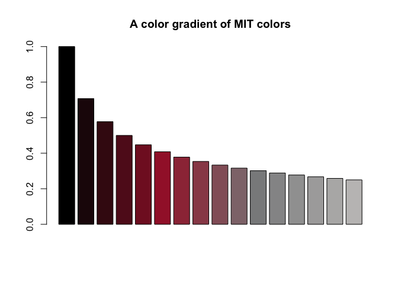

# unicol 0.4.0.9001

### The colors of your university

Most universities use specific color combinations to express their
unique brand identity. The **unicol** package provides the colors and
color palettes of various universities for easy plotting and printing
in R. We collect and provide a diverse range of color palettes for
creating scientific visualizations.

Our primary goal is to make it simple to create beautiful visualizations
that are in accordance with institutional regulations and style guides.
Assuming that you have some R code for creating an image, **unicol**
allows you to directly use the color palette of your institution.

## Installation

The latest release of **unicol** is available from
[CRAN](https://CRAN.R-project.org) at
<https://CRAN.R-project.org/package=unicol>:

``` r
install.packages('unicol')  # install from CRAN client
library('unicol')           # load the package
```

The current development version can be installed from its
[GitHub](https://github.com) repository at
<https://github.com/hneth/unicol/>:

``` r
# install.packages('devtools')  # install pkg
devtools::install_github('hneth/unicol')
```

The **unicol** package is based on the R package
**[unikn](https://CRAN.R-project.org/package=unikn)** and requires it
for key functionality.

## Usage

The **unicol** package provides colors and color palettes, whereas the
**[unikn](https://CRAN.R-project.org/package=unikn)** package provides
color-related functions:

``` r
library(unicol)  # for color palettes
library(unikn)   # for color functions
```

## Contents

The **unicol** package currently provides **273 color palettes** from
**116 institutions**.

(See the vignette **[All color
palettes](https://hneth.github.io/unicol/articles/color_pals.html)** for
an overview of included color palettes and institutions.)

### Examples of color palettes

**Figure 1** illustrates 50 random color palettes (with 215 colors):


Figure 1: A sample of 50 unicol palettes (containing 215 colors).

### Using color palettes

As the **unicol** palettes are provided as vectors of R colors, they can
simply be used as the `col` argument of R graphics functions. For
instance, we can use the MIT colors (of the [Massachusetts Institute of
Technology](https://web.mit.edu/)) in a bar plot (with the
[`barplot()`](https://rdrr.io/r/graphics/barplot.html) function of the
base R **graphics** package) as follows:

``` r
barplot(height = 1:10,
        col = mit, 
        main = "Using the MIT colors")
```


To modify a color palette (e.g., by resizing the palette or adding
transparency), we use the
[`usecol()`](https://rdrr.io/pkg/unikn/man/usecol.html) function of the
**[unikn](https://CRAN.R-project.org/package=unikn)** package:

``` r
barplot(height = 1/sqrt(1:16), 
        col = usecol(mit, n = 16), 
        main = "A color gradient of MIT colors")
```



Here are some some additional examples how the color palettes from
**unicol** can be used:

``` r
# Viewing a color palette:
unikn::seecol(yale, main = "The primary colors of Yale University")
```


``` r
# Demo plots:
unikn::demopal(berkeley_1, type = 2, main = "The colors of Berkeley, University of California", seed = 3)
```


``` r
unikn::demopal(limerick_1, type = 3, main = "Using the colors of the University of Limerick", seed = 3)
```


## Your color palettes

The current range of color palettes included in **unicol** is highly
selective and incomplete. However, we are happy to include color
palettes and institutions from all over the world.

If you are missing a color palette, you can easily create and add it.
For instructions on how this can be done, please see the documentation
of the [`newpal()`](https://rdrr.io/pkg/unikn/man/newpal.html) function
(of the **[unikn](https://CRAN.R-project.org/package=unikn)** package).
The vignette on [Institutional
colors](https://hneth.github.io/unikn/articles/inst_colors.html)
provides a corresponding example.

**Call for contributions: Collecting color palettes**

- Are you using the **unikn** functions to create **your own color
  palettes**?

If you do, **please let us know** (e.g., on this [GitHub
issue](https://github.com/hneth/unicol/issues/30)) so that we can
include it in future versions of the **unicol** package. To enable us to
verify and provide credit to your contributions, please send us the
following information:

[](https://github.com/hneth/unicol/issues/30)

1.  your code (e.g., the
    [`newpal()`](https://rdrr.io/pkg/unikn/man/newpal.html) command
    creating your color palette),  
2.  your reference or source information (e.g., the names of the
    institution and some URL with color definitions),  
3.  your name and some valid contact information (e.g., an Email
    address).

We’re looking forward to **your inputs and contributions** (at [this
GitHub issue](https://github.com/hneth/unicol/issues/30))!

## Resources

The following versions of **unicol** and corresponding resources are
available:

| Type:                      | Version:                                                     | URL:                                        |
|:---------------------------|:-------------------------------------------------------------|:--------------------------------------------|
| A. **unicol** (R package): | [Release version](https://CRAN.R-project.org/package=unicol) | <https://CRAN.R-project.org/package=unicol> |
|                            | [Development version](https://github.com/hneth/unicol/)      | <https://github.com/hneth/unicol/>          |
| B. Online documentation:   | [Release version](https://hneth.github.io/unicol/)           | <https://hneth.github.io/unicol/>           |
|                            | [Development version](https://hneth.github.io/unicol/dev/)   | <https://hneth.github.io/unicol/dev/>       |

## References

[](https://www.uni-konstanz.de)

The **unicol** package originated as a collaborative project of the
following course:

- **Open Source Software Development in R** (ADILT applications,
  PSY-18040), at the **[University of
  Konstanz](https://www.uni-konstanz.de/en/)**  
- Spring/Summer 2023: **Tuesdays**, **13:30—15:00**; in **C426**
- By **[Hansjörg Neth](https://neth.de/)** (<h.neth@uni.kn>,
  [SPDS](https://spds.uni-konstanz.de/), [University of
  Konstanz](https://www.uni-konstanz.de/en/))

### License

[](https://creativecommons.org/licenses/by-sa/4.0/)

**unicol** (created by [Hansjörg Neth et
al.](https://github.com/hneth/unikn)) is licensed under a [Creative
Commons Attribution-ShareAlike 4.0 International
License](https://creativecommons.org/licenses/by-sa/4.0/). (Based on a
work at
[https://github.com/hneth/unicol](https://github.com/hneth/unicol)).

The **unicol** package is based on the R package
**[unikn](https://CRAN.R-project.org/package=unikn)** and loads key
functionality from it.

### Citation

[](https://CRAN.R-project.org/package=unicol)

To support our efforts, please cite the **unicol** package in your
derivations or publications:

- Neth, H. et al. (2025). unicol: The colors of your university.  
  Social Psychology and Decision Sciences, University of Konstanz,
  Germany.  
  Computer software (R package version 0.4.0, Sep 2, 2025).  
  Retrieved from <https://CRAN.R-project.org/package=unicol>.  
  doi [10.5281/zenodo.8252106](https://doi.org/10.5281/zenodo.8252106)

A BibTeX entry for LaTeX users is:

``` R
@Manual{,
  title = {unicol: The colors of your university},
  author = {Hansjoerg Neth and Constantin Basler and Paula Bauer and Kaethe Bodenstein and Franziska Drechsel and Gina-Loretta Franz and Karolin Heiss and Julia Koenig and Isabelle Krist and Larissa Schwab and Alina Sohst and Isabel Staatz and Lisa Trueb},
  year = {2025},
  organization = {Social Psychology and Decision Sciences, University of Konstanz},
  address = {Konstanz, Germany},
  note = {R package (version 0.4.0, Sep 2, 2025)},
  url = {https://CRAN.R-project.org/package=unicol},
  doi = {10.5281/zenodo.8252106},
}
```

The copyrights to all **unicol** designs remain with their original
creators.

------------------------------------------------------------------------

\[File `README.Rmd` updated on 2025-12-12.\]
